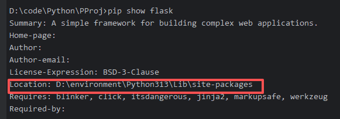
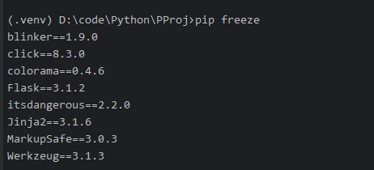
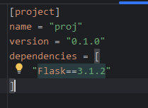
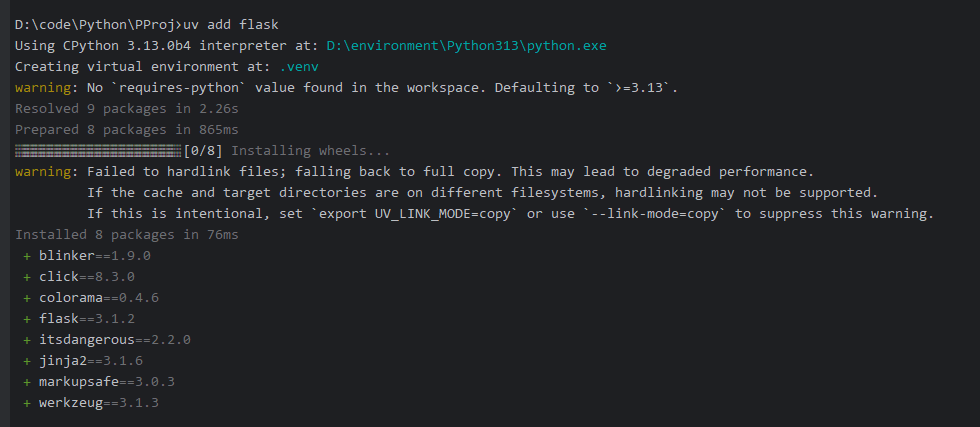

## Python 项目工程

现在的 python 主要分为两大流派：
1. conda 宇宙
2. python 官方

> python 官方工具

* 打包工具
  * setuptools 
  * hatching 

* 安装管理项目
  * uv
  * pip
  * poetry

### 1. 使用pip

这是最开始项目的使用和构建方式，因为需要使用flask, 所以我们需要安装。

使用
```commandline
pip install flask
```

可以安装 flask, 但是这种安装有个问题，那就是这种方式会将 flask 安装到全局环境，如果这个项目使用的是 v1 版本，而其他的项目使用的是v2版本，就非常麻烦。

使用 
```commandline
pip show flask 
```

可以查看安装的情况。



我们发现被安装到全局环境中了。

解决方案是:

> venv 虚拟环境

使用
```commandline
python -m venv .venv
```

的方式创建一个虚拟环境，这个虚拟环境包含所有的项目运行的依赖和环境要求。

执行完成之后你会发现项目中多了一个.venv的文件夹，这个就是我们的虚拟环境。

在创建了虚拟环境之后，如果使用的不是ide，那么我们需要去激活这个虚拟环境：

活虚拟环境（Windows、macOS和Linux的激活命令有所不同）：

Windows:
```commandline
./.venv/Scripts/activate
```

macOS/Linux:

```commandline
source .venv/bin/activate
```

激活之后，再安装flask，flask就会被安装到虚拟环境中。

解决了上述问题之后，就出现了第二个问题，怎么将我们的环境分享给其他用户或者开发者。

1. 早期做法：

使用 pip freeze 命令输出所有的环境
```commandline
pip freeze
```



通常，我们会使用重定向服务将这些输出到一个文件中 requirements.txt

```commandline
pip freeze > requirements.txt
```

这样当其他的用户拿到项目的时候，只需要在自己的环境中使用

```commandline
pip install -r requirements.txt
```
就可以将这些依赖全部安装，从而实现复现环境。

但是这个方法有个很大的缺陷，就是 pip freeze 无法分清什么是项目的直接依赖，什么是直接依赖的间接依赖。

例如我们只需要引入 flask，但是实际上我们引入了7个包

我们在卸载的时候使用pip uninstall flask 往往只能删除flask, 而他的间接依赖的包则不会删除。

在大型项目中，这样做会导致虚拟环境中有大量的无效包！

为了解决这个问题：

python 官方使用 pyproject.toml 去配置管理文件

文件结构内容见图：


可以看到，依赖文件只要指定 Flask这一个就可以了，如果想删掉依赖，只要删除 Flask 这一行就行了，这样就能解决上面的孤儿依赖的问题。

配置文件写好后，使用

```commandline
pip install .
```

来执行依赖安装. 但是如果使用 pip install . 则会把我们的源码也安装进去

我们使用
```commandline
pip install -e .
```

来避免源码的安装。

到此为止，一个手动的包安装和管理过程已经结束了，在这个流程中，我们解决了很多问题，但是我们还有问题没有解决。

比如： 无法通过一条 pip install xxx 命令来安装了，我们需要手工编写配置文件

### 2. UV

这些工具的底层其实用的也是 pip 和 pyproject 这样的方式，但是他们提供了一套更简单的API

在之前：我们创建一个环境需要：

```commandline
python -m venv .venv # 创建虚拟环境
source .venv/Scripts/activate  # 激活环境
vim pyproject.toml  # 编写配置文件
pip install -e .    # 安装依赖
```

而现在，我们只要一条命令:

```commandline
uv add flask
```



uv 就会帮我们创建虚拟环境，安装依赖。

如果拿到的是别人的环境，只要执行：

```commandline
uv sync
```

uv就会帮我们搭建好环境以及安装好依赖。

需要运行的时候，我们只要激活虚拟环境，然后运行即可。

uv 提供给我们不需要激活环境的做法:

```commandline
uv run main.py
```

uv会自己找虚拟环境，激活，运行，再退出来。