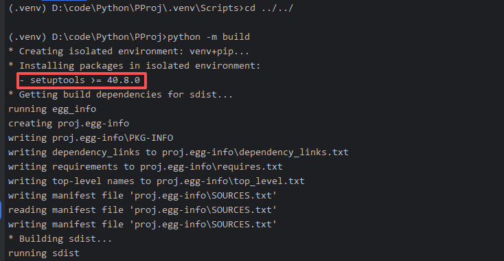
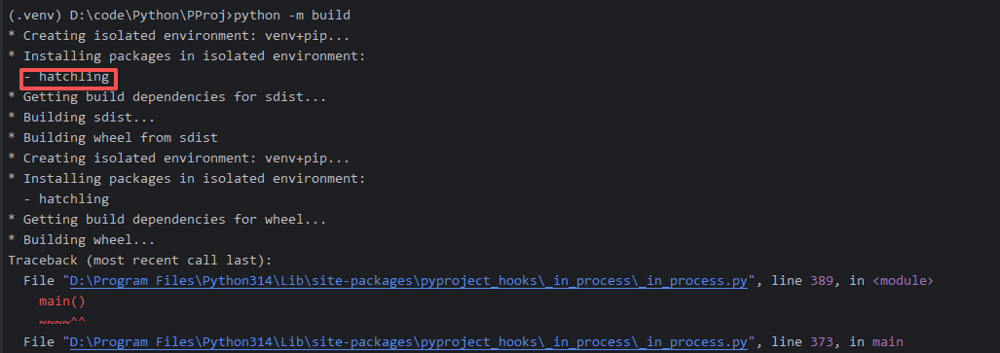
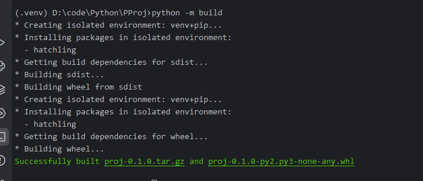

### 安装依赖

我们使用 pip uv poetry 安装软件包的时候，背后都是从pypi这个网站上下载东西。

我们下载的文件一般是whl文件，简单来说这个whl文件就是一个压缩包

例如我们使用：

```commandline
pip install flask
```

本质上就是下载了一个flask的whl文件并把它解压缩到了site-packages目录下。

whl文件的结构比较自由，以flask为例

flask

    L --- app.py
    L --- ctx.py

我们可以把代码放到一个和包名相同的目录下，也可以直接放跟目录下

### 打包

一般来说，python 官方的规范中将打包工具分成两个模块： frontend 和 backend。

我们平常使用的命令行工具是frontend提供的,frontend 调用 backend ,backend会将文件打包成一个whl文件。

官方推荐的frontend工具是 build, 推荐的backend的工具是 setuptools

### 案例

我们使用 build 作为frontend ， setuptools 因为配置过于复杂，我们使用hatchling来作为backend。

```commandline
pip install build
```

安装build工具

```commandline
python -m build
```

进行打包，默认情况下，python会使用setuptools来进行打包。



> 使用hatchling来进行打包

修改pyproject.toml文件

```commandline
[project]
name = "proj"
version = "0.1.0"
dependencies = [
    "flask>=3.1.2",
]

[build-system]
requires = ["hatchling"]
build-backend = "hatchling.build"
```



我们发现已经变成了hatchling来进行打包，但是此时我们当前的项目结构不符合hatchling的要求，我们修改配置文件：

```commandline
[project]
name = "proj"
version = "0.1.0"
dependencies = [
    "flask>=3.1.2",
]

[build-system]
requires = ["hatchling"]
build-backend = "hatchling.build"

[tool.hatch.build.targets.wheel]
packages = ["main.py"]
```

再次执行```python -m build```



打包成功，打好的包放在了dist文件夹下。

上述这种打包方式，安装之后 源码会安装在虚拟环境的根目录下。我们推荐按照目录分级

简单的项目我们可以使用这种方式

### 项目结构

复杂的正式的项目结构，在根目录下应该有

* src: 源码目录
* test: 测试文件目录
* docs: 文档目录
* ...

使用这种项目结构，hatchling 的配置不需要添加src这个目录，比如我们可以这么写：

```commandline
[project]
name = "proj"
version = "0.1.0"
dependencies = [
    "flask>=3.1.2",
]

[build-system]
requires = ["hatchling"]
build-backend = "hatchling.build"

[tool.hatch.build.targets.wheel]
packages = ["src/main.py"]
```

事实上， src目录是hatchling默认的项目结构，所以我们其实可以去掉packages这个配置，例如

```commandline
[project]
name = "proj"
version = "0.1.0"
dependencies = [
    "flask>=3.1.2",
]

[build-system]
requires = ["hatchling"]
build-backend = "hatchling.build"
```

上下两个配置文件是等效的，但是根据hatchling的默认规则，使用下面这种方式配置的话，需要在要打包的src/xxx

目录下创建一个__init__.py文件，这样hatchling才会将src/xxx目录作为一个包来处理。

所以一般在src下，我们一般都是先创建一个包名，其他的东西都在这个包下。

我们在开发的时候，一定要执行一次 ```pip install -e .```

这个命令的意思是将项目本身安装进虚拟环境，-e 表示编辑模式，使用-e 项目的源码不会真的安装进虚拟环境，而是
安装了一个类似的快捷方式